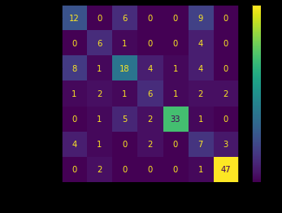

# Facial Emotion Recognition

Our implementation of this [paper](https://link.springer.com/article/10.1007/s11042-016-3418-y) as a part of CS - 419 (Computer Vision) course's final project

## Problem Statement

Given an image (I) of a person, we must extract meaningful features from it and classify it into one of the following emotions: anger, contempt, disgust, fear, happiness, sadness, or surprise.

## Clone this repository

```bash
git clone https://github.com/kushaangowda/Facial_Emotion_Recognition.git
```

## Files

1. facial_landmarks_LBP.ipynb: to extract LBP features
2. facial_landmarks_NCM.ipynb: to extract NCM features
3. SVM.ipynb: to train the classifier

## Methodology

The authors first use landmark detection to divide the face into 29 regions and employ Local Binary Pattern (LBP) and Normalized Central Moments (NCM) to extract corresponding features of specific regions. These features are then concatenated and forwarded to the SVM for classification.

## Dataset

We used the Extended Cohn-Kanade (CK+) dataset, available on [Kaggle](https://www.kaggle.com/datasets/shawon10/ckplus). It consists of 981 images of humans, each segregated into one of the seven emotions: anger, contempt, disgust, fear, happiness, sadness, or surprise. The size of the image is 48 X 48 px.

## Experimental Analysis

Train-Test split = 80:20 (random) \
Test Accuracy = 65.15%


## Team Members

[Kushaan Gowda](https://github.com/kushaangowda) \
[Abhinav Reddy](https://github.com/pixelbullet) \
[Khajjayam Abhiram](https://github.com/Abhiram0201)
